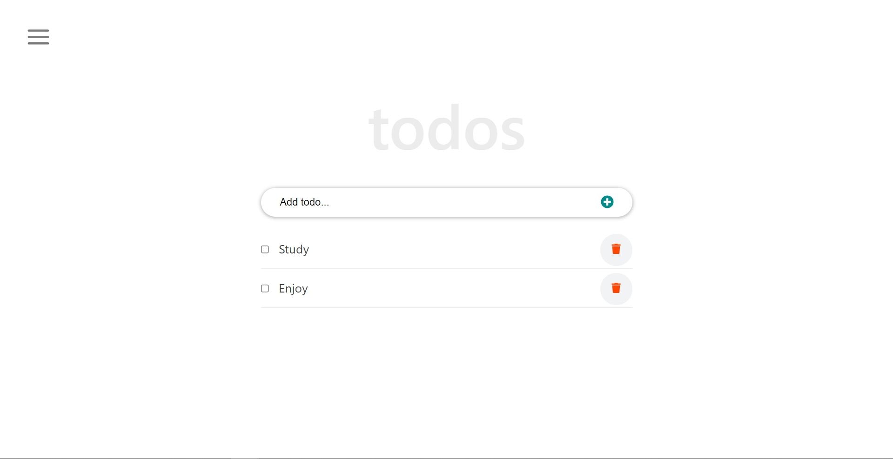

# React Tutorial Microverse Ibaslogic

> This is a React project where a user can make use of an application based on a ToDo list, in this project the user can create a list of tasks to do, can edit those tasks, and can delete them this, application was made with React.


## Built With

- React
- HTML
- CSS
- JavaScript
- ESLint

## Live Demo

[Live Demo Link](https://aristides1000.github.io/react-tutorial-ibaslogic-microverse/)

## Getting Started
1. Clone this repo on your local machine

2. In the path where your repository is located, you will open your terminal.

3. In the path where your repository is located you are going to open your terminal and put ```npm install``` hit enter, after that type the command ```npm start```.

4. Enjoy.

### Prerequisites
To make this repository working in your local machine you need only a browser.

## Author

👤 **Arístides José Molina Pérez**

- Github: [@aristides1000](https://github.com/aristides1000)
- Twitter: [@aristides_1000](https://twitter.com/aristides_1000)
- Linkedin: [Aristides Jose Molina Perez](https://www.linkedin.com/in/aristides-molina/)

## 🤝 Contributing

Contributions, issues and feature requests are welcome!

Feel free to check the [issues page](https://github.com/aristides1000/react-tutorial-ibaslogic-microverse/issues).


## Show your support

Give a ⭐️ if you like this project!

## Available Scripts

In the project directory, you can run:

### `yarn start`

Runs the app in the development mode.\
Open [http://localhost:3000](http://localhost:3000) to view it in the browser.

The page will reload if you make edits.\
You will also see any lint errors in the console.

### `yarn test`

Launches the test runner in the interactive watch mode.\
See the section about [running tests](https://facebook.github.io/create-react-app/docs/running-tests) for more information.

### `yarn build`

Builds the app for production to the `build` folder.\
It correctly bundles React in production mode and optimizes the build for the best performance.

The build is minified and the filenames include the hashes.\
Your app is ready to be deployed!

See the section about [deployment](https://facebook.github.io/create-react-app/docs/deployment) for more information.

### `yarn eject`

**Note: this is a one-way operation. Once you `eject`, you can’t go back!**

If you aren’t satisfied with the build tool and configuration choices, you can `eject` at any time. This command will remove the single build dependency from your project.

Instead, it will copy all the configuration files and the transitive dependencies (webpack, Babel, ESLint, etc) right into your project so you have full control over them. All of the commands except `eject` will still work, but they will point to the copied scripts so you can tweak them. At this point you’re on your own.

You don’t have to ever use `eject`. The curated feature set is suitable for small and middle deployments, and you shouldn’t feel obligated to use this feature. However we understand that this tool wouldn’t be useful if you couldn’t customize it when you are ready for it.

## Learn More

You can learn more in the [Create React App documentation](https://facebook.github.io/create-react-app/docs/getting-started).

To learn React, check out the [React documentation](https://reactjs.org/).

### Code Splitting

This section has moved here: [https://facebook.github.io/create-react-app/docs/code-splitting](https://facebook.github.io/create-react-app/docs/code-splitting)

### Analyzing the Bundle Size

This section has moved here: [https://facebook.github.io/create-react-app/docs/analyzing-the-bundle-size](https://facebook.github.io/create-react-app/docs/analyzing-the-bundle-size)

### Making a Progressive Web App

This section has moved here: [https://facebook.github.io/create-react-app/docs/making-a-progressive-web-app](https://facebook.github.io/create-react-app/docs/making-a-progressive-web-app)

### Advanced Configuration

This section has moved here: [https://facebook.github.io/create-react-app/docs/advanced-configuration](https://facebook.github.io/create-react-app/docs/advanced-configuration)

### Deployment

This section has moved here: [https://facebook.github.io/create-react-app/docs/deployment](https://facebook.github.io/create-react-app/docs/deployment)

### `yarn build` fails to minify

This section has moved here: [https://facebook.github.io/create-react-app/docs/troubleshooting#npm-run-build-fails-to-minify](https://facebook.github.io/create-react-app/docs/troubleshooting#npm-run-build-fails-to-minify)

## Acknowledgments

- Ariel Camus CEO Microverse: For letting us start this journey.
- Google: For letting us find crucial information in order to create this project.

## 📝 License

This project is [CC0-1.0](LICENSE) licensed.
